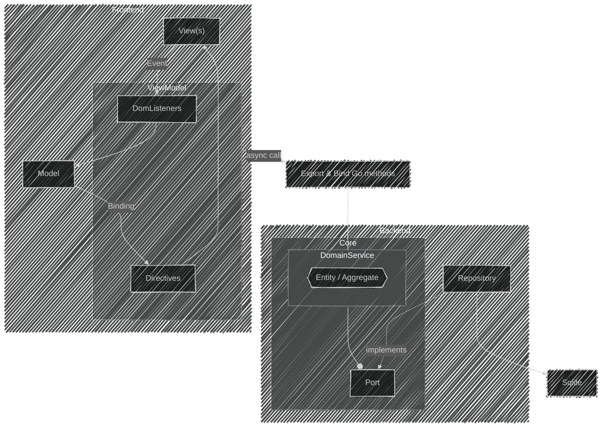

# Architecture Document

## Revision History
| Version | Date       | Author | Description                  |
|---------|-----------|--------|------------------------------|
| 0.1.0   | 2025-09-29 | Tuan   | Initial draft                |
## 1. Introduction
- Purpose of this document  
- Scope of the system  
- Target audience (developers, stakeholders, recruiters)  
- Short description of the application (e.g., desktop app built with Wails, provides flashcard management with Decks & Cards)

---

## 2. Context
The Flashcard Application is a desktop app built with Wails (Vue + Go).
Users interact with the frontend UI to manage Decks and Cards.
The backend runs locally in Go and stores data in a SQLite database.
No external services are currently used.

## 3. Architecture Views
### 3.1 Logical view

### 3.3 Data view
## 4. Design Decisions
### 4.1 Application frameowork: Wails
Context:
    The application needs to be a desktop app with:

    A modern UI (smooth, responsive, user-friendly).

    A smooth developer workflow (fast build/run, easy packaging).

    Vue 
Considered options:
- Electron
- Tauri
- Wails

| Criteria                | Electron                                | Tauri                                    | Wails                                    |
|--------------------------|-----------------------------------------|------------------------------------------|------------------------------------------|
| **Languages (Backend)** | Node.js (JavaScript/TypeScript)         | Rust                                     | Go                                       |
| **Frontend**            | Any web framework (Vue, React, Angular) | Any web framework (Vue, React, Angular)  | Any web framework (Vue, React, Angular)  |
| **Runtime**             | Bundles Chromium + Node.js              | Uses system WebView + Rust runtime        | Uses system WebView + Go runtime         |
| **App Size**            | Large (tens to hundreds of MB)          | Very small (as low as <5 MB)             | Small (similar to Tauri, usually <10 MB) |
| **Performance**         | Heavy RAM/CPU usage (due to Chromium)   | Lightweight, low memory footprint         | Lightweight, near-native speed            |
| **Security**            | Sandboxing available, but heavier       | Strong security model, minimal surface    | Security depends on Go code, no built-in sandbox |

Decision:
Use Wails as the application framework.
- familiar with Go.

- Wails supports Vue, which fits my preferred UI framework.

- Compared to Electron, Wails is lighter, with smaller bundle size and lower runtime memory usage.

- I don’t know Rust, so Tauri would have a steep learning curve.

### 4.2 Application’s database: SQLite

SQLite is lightweight and easy to embed in a desktop application.

No setup or separate server process required — makes distribution and installation much simpler.

Provides sufficient features (SQL support, transactions, ACID compliance) for local persistence.

Fits well with the scope of the app (single-user, local data).

### 4.3 Architectural Choice: Hexagonal (Ports & Adapters)
Hexagonal Architecture (a.k.a. Ports and Adapters) is selected for this project. While it may be considered over-engineering for a small-scale system, the decision is intentional to gain the following benefits:
- Separation of Concerns

- Flexibility
External dependencies (e.g., databases, APIs, UI frameworks) are accessed via well-defined ports. Adapters can be swapped with minimal impact on the domain layer.

- Improved Testability
The domain layer can be tested in isolation by mocking ports, reducing the need for complex integration environments during early development.

- Long-term Maintainability
Even though the current scope is small, practicing this pattern builds consistent habits and prepares the codebase for scaling with new integrations or platforms.

Trade-offs

- Increased Complexity and Boilerplate:
  
    Extra layers (ports, adapters, DTOs) add overhead for a project of this size.

- Learning Curve
